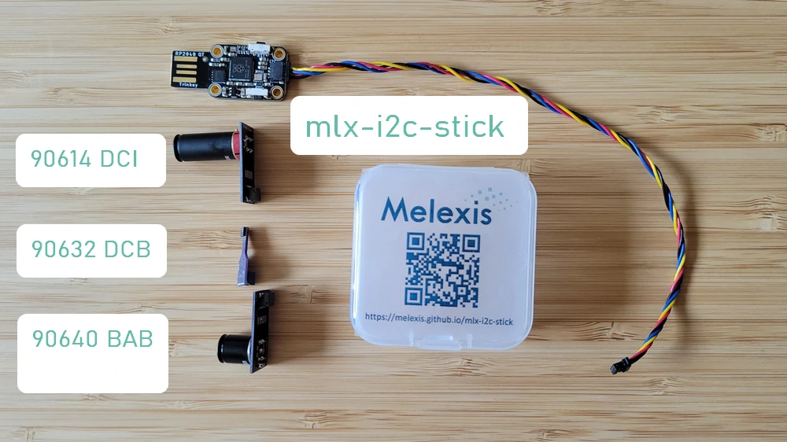

## Introduction

Yet another I2C interface...  
However `mlx-i2c-stick` aims to:  
- Provide a low cost interface towards our 3.3V supplied sensors who uses the I2C communication bus.
- Use as much as possbile off-the-shelf available material/modules.
- Create a friction free getting starting experience. 
- Enable prototyping using its small sensor boards.
- Provide a reference `code` (firmware) based on the arduino platform; snippets can be used in end-user-applications.

## What is mlx-i2c-stick?

A microcontroller with on one hand a USB CDC UART and on the other a I2C master at 3.3V.  
We provide open source firmware and an userinterface to easily get started with our I2C/3.3V based sensors.

## Getting started

1. Click the `open` button on the top right of the screen.
1. Select the serial port of the mlx-i2c-stick.
1. Enable the chart (transient or spatial)
1. The `Scan` button will scan the I2C bus for slaves
1. The `Start` button will start continiously measuring all recognised slaves
1. The `Stop` button will stop continiously measuring the slaves
1. The slaves will appear on the left column.
1. The `MV` button will initiate a singlee 'Measure Values' action.
1. The terminal let you do other cool stuff, more on this later.

## The hardware

### Public off-the-shelve Hardware

- RP2040 MCU: https://www.adafruit.com/product/5056
- QWIIC Cable: https://www.sparkfun.com/products/17258
- MLX90393: https://www.adafruit.com/product/4022
- MLX90614: https://www.sparkfun.com/products/17522
- MLX90640 Small FoV: https://www.adafruit.com/product/4407
- MLX90640 Wide FoV: https://www.adafruit.com/product/4469

### Melexis Sensor board Hardware

Our sensors boards minimizes the board size to the bare minimum while we maximize the capability to use the sensor boards in a prototype by having the sensor mounted at opposite site as the connector and other components.

PCB:
- MLX90632: https://github.com/melexis/mlx-i2c-stick/blob/main/mlx90632-breakout/readme.md
- MLX90614: https://github.com/melexis/mlx-i2c-stick/blob/main/mlx90614-breakout/readme.md
- MLX90640: https://github.com/melexis/mlx-i2c-stick/blob/main/mlx90640-breakout/readme.md

## Disclaimer

The content of this document is believed to be correct and accurate. However, the content of this document is furnished "as is" for informational use only and no representation, nor warranty is provided by Melexis about its accuracy, nor about the results of its implementation. Melexis assumes no responsibility or liability for any errors or inaccuracies that may appear in this document. Customer will follow the practices contained in this document under its sole responsibility. This documentation is in fact provided without warranty, term, or condition of any kind, either implied or expressed, including but not limited to warranties of merchantability, satisfactory quality, non-infringement, and fitness for purpose. Melexis, its employees and agents and its affiliates' and their employees and agents will not be responsible for any loss, however arising, from the use of, or reliance on this document.
This document is subject to change without notice, and should not be construed as a commitment by Melexis. Therefore, before placing orders or prior to designing the product into a system, users or any third party should obtain the latest version of the relevant information.
Users or any third party must determine the suitability of the product described in this document for its application, including the level of reliability required and determine whether it is fit for a particular purpose.
This document as well as the product here described may be subject to export control regulations. Be aware that export might require a prior authorization from competent authorities. The product is not designed, authorized or warranted to be suitable in applications requiring extended temperature range and/or unusual environmental requirements. High reliability applications, such as medical life-support or life-sustaining equipment or avionics application are specifically excluded by Melexis. The product may not be used for the following applications subject to export control regulations: the development, production, processing, operation, maintenance, storage, recognition or proliferation of:
1. chemical, biological or nuclear weapons, or for the development, production, maintenance or storage of missiles for such weapons;
2. civil firearms, including spare parts or ammunition for such arms;
3. defense related products, or other material for military use or for law enforcement;
4. any applications that, alone or in combination with other goods, substances or organisms could cause serious harm to persons or goods and that can be used as a means of violence in an armed conflict or any similar violent situation.
 
No license nor any other right or interest is granted to any of Melexis' or third party's intellectual property rights.
This disclaimer will be governed by and construed in accordance with Belgian law and any disputes relating to this disclaimer will be subject to the exclusive jurisdiction of the courts of Brussels, Belgium.
The invalidity or ineffectiveness of any of the provisions of this disclaimer does not affect the validity or effectiveness of the other provisions. The previous versions of this document are repealed.  

Melexis ©2022

IATF 16949 and ISO 14001 Certified
